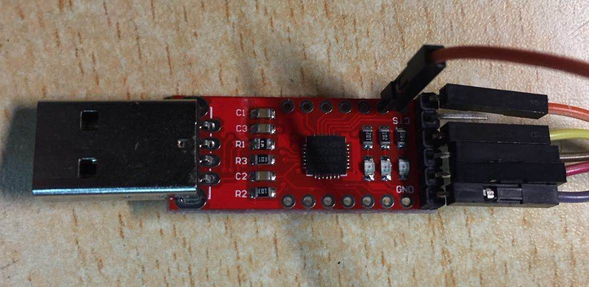
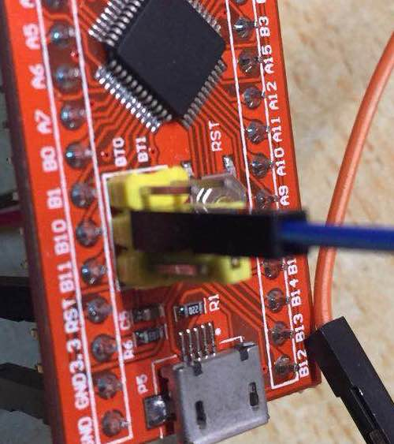
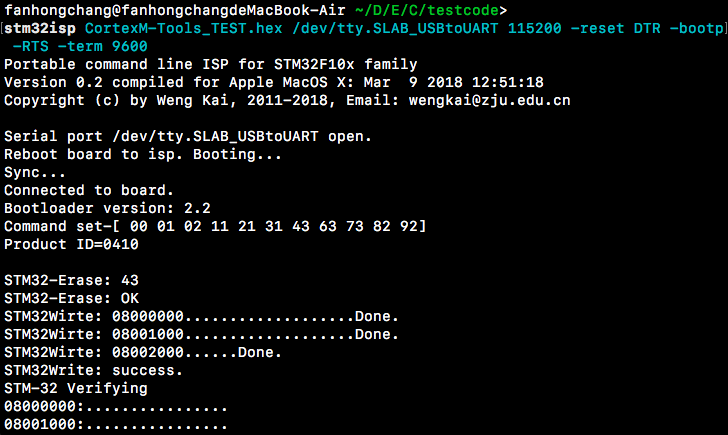
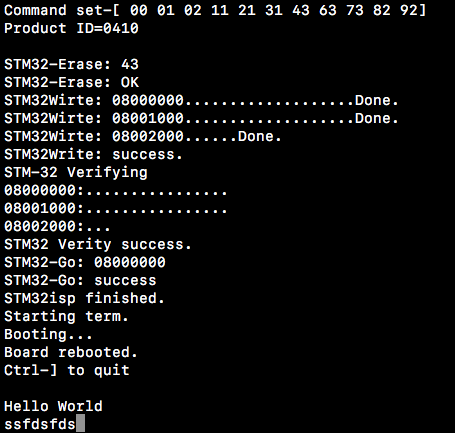
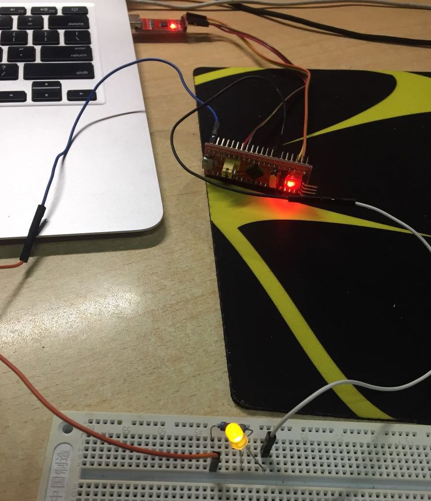

# 命令行的串口下载工具-MacOS

## USB转串口芯片驱动
实验套装中有一个USB转串口芯片，使用该芯片需要安装该芯片的驱动，这里是[下载地址](https://cn.silabs.com/products/development-tools/software/usb-to-uart-bridge-vcp-drivers)

找到MacOS对应的驱动下载安装即可，注意在安装过程中需要在系统设置中允许其安装。
## 串口连接方式
使用杜邦线将USB转串口芯片连接到stm32板上，具体连接方式为：
<table>
  <tr>
    <th  bgcolor=yellow>STM32</th>
    <th  bgcolor=yellow>USB转串口芯片</th>
  </tr>
  <tr>
    <td> 5V </td>
    <td> VCC </td>
  </tr>
  <tr>
    <td> GND </td>
    <td> GND </td>
  <tr>
    <td> A9 </td>
    <td> RXD </td>
  </tr>
  <tr>
    <td> A10 </td>
    <td> TXD </td>
  </tr>
  <tr>
    <td> reset </td>
    <td> DTR </td>
  </tr>
  <tr>
    <td> BT0 </td>
    <td> RTS </td>
  </tr>
</table>

其中DTR和RTS端口连接reset和BT0端口是为了使用上位机自动控制单片机的引导程序和程序复位，有这两条线的连接，就可以做到一键自动选择引导程序下载程序并在下载完毕后切换到刚刚下载的程序自动执行。

>通过BT0和BT1可以更换执行方式，在下载时改为执行ROM中的程序，ROM中是厂家烧录的程序，用于支持将程序下载到Flash储存中，在下载完成后将BT0改到0，转换到执行Flash储存的程序（即刚刚烧录的程序）。

## MacOS串口下载工具
Github上翁恺老师写了一个适用于Unix系统的串口下载工具stm32isp，[这里是地址](https://github.com/wengkai/stm32isp), clone到本地编译安装（make install）后即可在终端直接使用该工具。
## 进行下载
6根线连接完成后将USB插入电脑，此时可以在终端中找到/dev目录下找到一个新的tty.SLAB_USBtoUART设备，说明驱动成功安装并连接，这时候就可以使用stm32isp工具将hex文件下载到单片机

cd进入之前的测试代码testcode文件夹，输入
`stm32isp CortexM-Tools_TEST.hex /dev/tty.SLAB_USBtoUART 115200 -reset DTR -bootp -RTS -term 9600`

第一个参数是hex文件路径，第二个参数是串口设备文件，第三个参数是波特率，`-reset`设置复位端口连接的线，这里指定为DTR，`-bootp`设置BT0端口连接的线，这里设置为-RTS，多加的`-`表示低电平。`-term 9600`指定在下载完成后用9600的波特率开启串口终端，这样可以在下载完成后使用串口终端来检查下载结果。工具的详细使用方式运行工具后有提示。下载工具运行后会自动完成连接、下载并自动执行。

在这里我们可以看到stm32通过串口发送的`Hello World`以及后续的输入回显。
## 下载结果验证

下载完毕后，除了串口意外，我们还可以通过测试A2端口能否控制LED灯的闪烁来确认是否下载成功。具体连接方式如下：

将stm32的A2端口接到LED灯的正极，串联一个实验套装中的电阻后连回stm32上的GND端口，stm32的供电可以通过保持USB转串口芯片的连接，并保持与电脑的连接来供应5V电源。

观察LED灯是否闪烁，若闪烁即证明下载成功。
