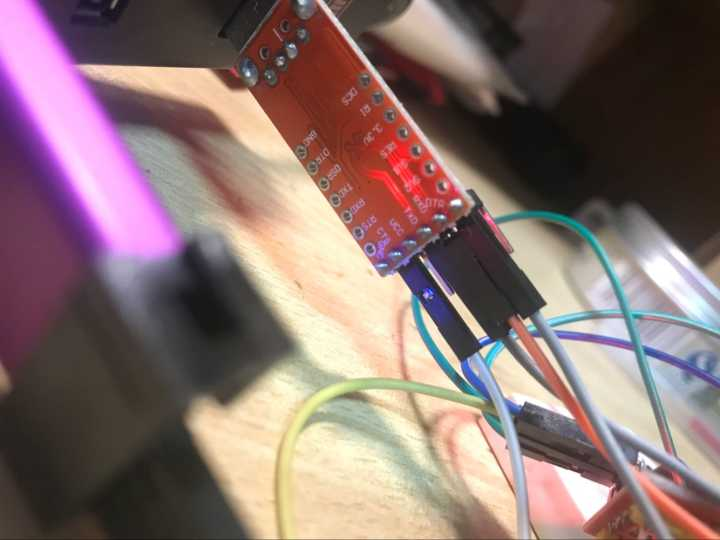
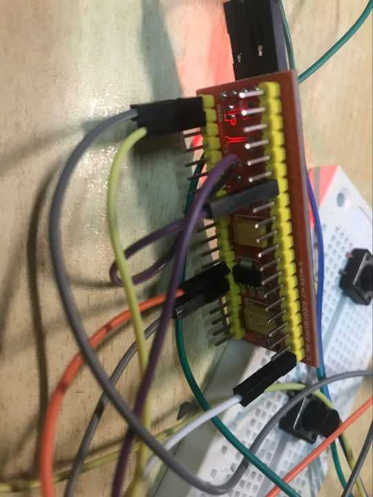
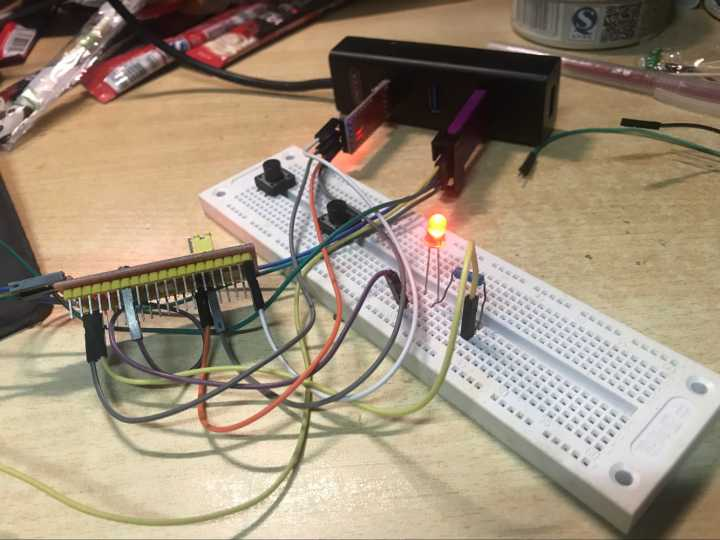

# 测试用的例子代码 #

## 要求 ##
1. 包含全部源码
2. 用gcc编译
3. 有Makefile,编译后生成hex
4. 给出LED的连线图和照片
5. 给出CP2102连103板的连线图和照片

## 目录结构 ##
* CortexM-Tools_TEST
	* CMSIS
		* core_cm3.c
		* core_cm3.h
		* stm32f10x.h
		* system_stm32f10x.c
		* system_stm32f10x.h
	* Lib
		* inc
			* misc.h
			* stm32f10x_rcc.h
			* stm32f10x_usart.h
			* stm32f10x_gpio.h
			* stm32f10x_exti.h
		* src
			* misc.c
			* stm32f10x_rcc.c
			* stm32f10x_usart.c
			* stm32f10x_gpio.c
			* stm32f10x_exti.c
	* Scripts
		* stm32_flash.ld
	* Startup
		* startup_stm32f10x_md.s
	* main.c
	* stm32f10x_conf.h
	* stm32f10x_it.c
	* stm32f10x_it.h
	* usr_conf.c
	* usr_conf.h

## MAKEFILE ##
```
# 生成的文件名<
PROJECT                  = CortexM-Tools_TEST

# 定义文件格式和文件名
TARGET                  := $(PROJECT)
TARGET_OUT              := $(TARGET).out
TARGET_HEX              := $(TARGET).hex
OBJCPFLAGS_ELF_TO_HEX    = -Oihex

# 定义路径
TOP_DIR      = .
SCRIPT_DIR  := $(TOP_DIR)/Scripts
STARTUP_DIR := $(TOP_DIR)/Startup
INC_DIR     := -I $(TOP_DIR)/Lib/inc -I $(TOP_DIR) -I $(TOP_DIR)/CMSIS

# 设置shell环境变量
#export LD_LIBRARY_PATH = $LD_LIBRARY_PATH:/Users/ch-yanghl/gcc-arm-none-eabi/arm-none-eabi/lib/thumb/

# 设置ld链接脚本文件
LDSCRIPT    := $(SCRIPT_DIR)/stm32_flash.ld

# 定义编译工具
CC          = arm-none-eabi-gcc
OBJCP       = arm-none-eabi-objcopy

# .c文件
CCFILE		:= ./CMSIS/*.c ./Lib/src/*.c *.c 

# 定义编译标志
CCFLAGS     += -mthumb -mcpu=cortex-m3 -mfloat-abi=soft -march=armv7-m

# .c文件编译时定义宏
CCFLAGS     += -D STM32F10X_MD -D USE_STDPERIPH_DRIVER

# 添加启动文件
SOURCE_ASM      += $(STARTUP_DIR)/startup_stm32f10x_md.S

# 替换文件后缀
C_OBJS      := $(SOURCE:%.c=%.o)
ASM_OBJS    := $(SOURCE_ASM:%.s=%.o)

# 编译命令的定义
COMPILE     = $(CC) $(INC_DIR) $(CCFLAGS) $(CCFILE) $(SOURCE_ASM) -Wl,--gc-sections -T $(LDSCRIPT) -o $@ 
ELF_TO_HEX  = $(OBJCP) $(OBJCPFLAGS_ELF_TO_HEX) $(TARGET_OUT) $@

# 定义伪目标
.PHONY: all clean printf

# 定义规则
all: $(TARGET_HEX)
	@echo "build done"

$(TARGET_HEX): $(TARGET_OUT)
	$(ELF_TO_HEX)

$(TARGET_OUT): $(CCFILE) $(SOURCE_ASM)                                                                                              
	$(COMPILE)

# 清理项
clean:
	rm -f $(TARGET_HEX)
	rm -f $(TARGET_OUT)
	rm -f $(C_OBJS)
	@echo "clean done"
```
## 用户配置 #

### RCC配置 ###
```
void RCC_Configuration()
{
	RCC_APB2PeriphClockCmd(RCC_APB2Periph_USART1|RCC_APB2Periph_GPIOA|RCC_APB2Periph_AFIO,ENABLE);
}
```
### GPIO配置 ###
```
void GPIO_Configuration()
{
	GPIO_InitTypeDef GPIO_InitStructure;
	
	//TX
	GPIO_InitStructure.GPIO_Speed = GPIO_Speed_50MHz;
	GPIO_InitStructure.GPIO_Pin = GPIO_Pin_9;
	GPIO_InitStructure.GPIO_Mode = GPIO_Mode_AF_PP;
	GPIO_Init(GPIOA,&GPIO_InitStructure);
	
	//RX
	GPIO_InitStructure.GPIO_Pin = GPIO_Pin_10;
	GPIO_InitStructure.GPIO_Mode = GPIO_Mode_IN_FLOATING;
	GPIO_Init(GPIOA,&GPIO_InitStructure);
	
	//LED
	GPIO_InitStructure.GPIO_Pin = GPIO_Pin_2;
	GPIO_InitStructure.GPIO_Mode = GPIO_Mode_Out_PP;
	GPIO_Init(GPIOA,&GPIO_InitStructure);
}
```
### USART配置 ###
```
void USART_Configuration()
{
	USART_InitTypeDef USART_InitStructure;
	
	USART_InitStructure.USART_BaudRate = 9600;
	USART_InitStructure.USART_WordLength = USART_WordLength_8b;
	USART_InitStructure.USART_StopBits = USART_StopBits_1;
	USART_InitStructure.USART_Parity = USART_Parity_No;
	USART_InitStructure.USART_HardwareFlowControl = USART_HardwareFlowControl_None;
	USART_InitStructure.USART_Mode = USART_Mode_Rx | USART_Mode_Tx;
	USART_Init(USART1,&USART_InitStructure);
	
	USART_ITConfig(USART1,USART_IT_RXNE,ENABLE);
	USART_Cmd(USART1,ENABLE);
	USART_ClearFlag(USART1,USART_FLAG_TC);
	
}
```
### NVIC配置 ###
```
void NVIC_Configuration()
{
	NVIC_InitTypeDef NVIC_InitStructure;
	
	NVIC_PriorityGroupConfig(NVIC_PriorityGroup_1);
	
	NVIC_InitStructure.NVIC_IRQChannel = USART1_IRQn;
	NVIC_InitStructure.NVIC_IRQChannelPreemptionPriority = 0;
	NVIC_InitStructure.NVIC_IRQChannelSubPriority = 1;
	NVIC_InitStructure.NVIC_IRQChannelCmd = ENABLE;
	NVIC_Init(&NVIC_InitStructure);
}
```
## main.c ##

### main函数 ###
```
int main()
{
	//Config
	RCC_Configuration();
	GPIO_Configuration();
	USART_Configuration();
	NVIC_Configuration();

	//Start Info
	sendString("Hello World\n");

	//Blink the LED
	int flag = 0;
	while(1){
		if(!flag){
			GPIO_WriteBit(GPIOA,GPIO_Pin_2,Bit_SET);
			delay_ms(500);
			flag = 1;
		}else{
			GPIO_WriteBit(GPIOA,GPIO_Pin_2,Bit_RESET);
			delay_ms(500);
			flag = 0;
		}
	}
	return 0;
}

```
### 中断处理程序 ###
```
void USART1_IRQHandler(){
	u8 RX_data;
	
	if(USART_GetFlagStatus(USART1,USART_FLAG_PE)!=RESET){
		USART_ReceiveData(USART1);
		USART_ClearFlag(USART1,USART_FLAG_PE);
	}
	if(USART_GetFlagStatus(USART1,USART_FLAG_ORE)!=RESET){
		USART_ReceiveData(USART1);
		USART_ClearFlag(USART1,USART_FLAG_ORE);
	}
	if(USART_GetFlagStatus(USART1,USART_FLAG_FE)!=RESET){
		USART_ReceiveData(USART1);
		USART_ClearFlag(USART1,USART_FLAG_FE);
	}
	
	if(USART_GetITStatus(USART1,USART_IT_RXNE)==SET){
		USART_ClearFlag(USART1,USART_FLAG_RXNE);
		USART_ClearITPendingBit(USART1,USART_IT_RXNE);
		RX_data = USART_ReceiveData(USART1);
		//while(USART_GetFlagStatus(USART1,USART_FLAG_RXNE) == RESET){}

		//debug info
		//GPIO_WriteBit(GPIOA,GPIO_Pin_3,(BitAction)(Bit_SET-GPIO_ReadOutputDataBit(GPIOA,GPIO_Pin_3)));
		
		USART_ITConfig(USART1,USART_IT_TXE,ENABLE);
		USART_SendData(USART1,RX_data);
		while(USART_GetFlagStatus(USART1,USART_FLAG_TXE) == RESET){}
		USART_ITConfig(USART1,USART_IT_TXE,DISABLE);
	}
	
}
```
## 连线图 ##

## 实物效果 ##

CP2102


103


LED


串口信息
