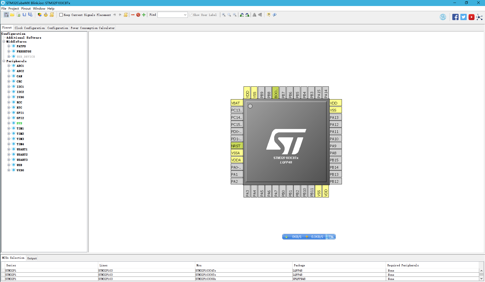
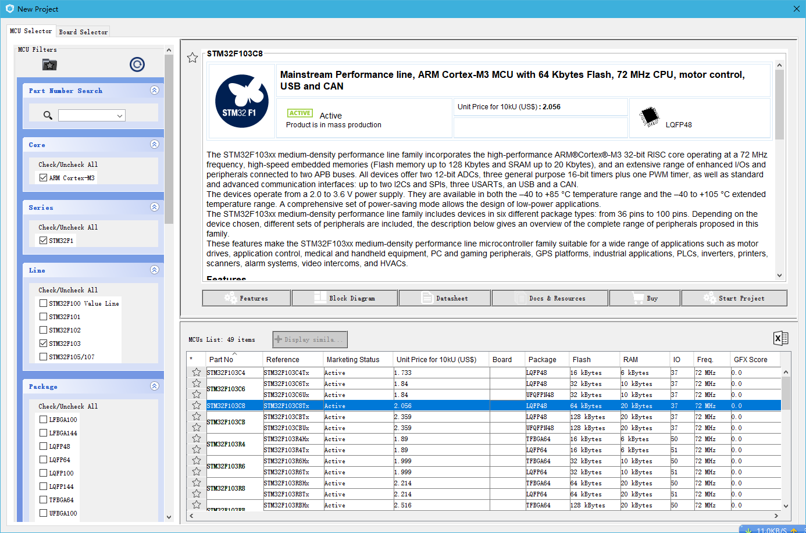
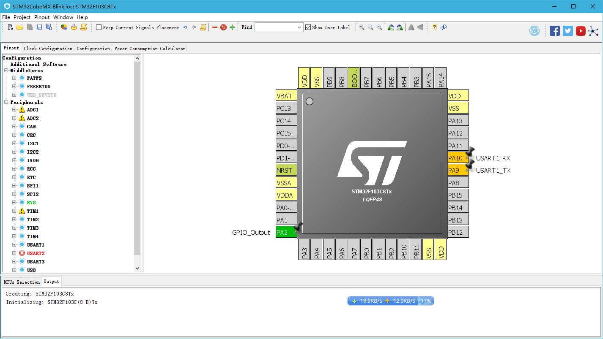
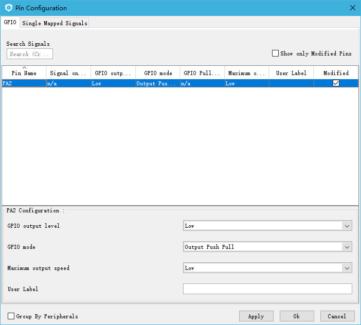
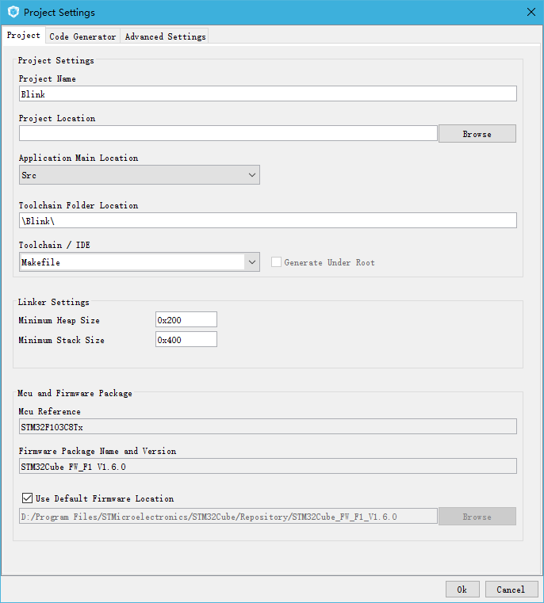

# STM32CubeMX Blink LED

## Prerequisites

* [STM32CudeMX](http://www.st.com/en/development-tools/stm32cubemx.html) from STMicroelectronics 
* Download STM32F1 Library in the CubeMX IDE (A proxy may be needed if you are in Mainland China)

## Blink a LED within CubeMX

### CubeMX IDE Overview



CubeMX appear just like other IDEs, with workspaces to configure the Pinout and Clock graphically. 

Click `Help` -> `Manage Embedded Software Packages` and download the package for `STM32F1`, I choose version 1.6.0.

### Create a project



Clink `Files` -> `New Project` and you will see a window to select the type of board you would like to program. According to our course, you should choose `STM32F103C8Tx`, the filter on the left side of the windows can help you find it faster.

### Configure the Pins

#### Step 1: Define the Pins 



In the center right of the IDE, a huge `STM32F103C8Tx` is displayed. Click on the the Pins you would like to modify and choose the function you want from the pop-up menu.

In this case, the Pins should be configured as follow:

* PA2:  GPIO_Output
* PA10: USART1_RX
* PA9:  USART1_TX

#### Step 2: Configure the Pins


Click on the `GPIO` Settings



Set PA2 mode to `Output Push Pull`

### Get the Code

#### Step 1: Configure the Project 



* Click `Project` -> `Settings..` and open the project settings window
* Set the toolchain to `Makefile`
* Set the project location and application main location

#### Step 2: Generate Code

Click `Project` -> `Generate Code` and you will find the code generated in the location that you have set in the Step 1.

In this step, only the initialization code is generated, you still need to program a little to let the board work (References can be found in `Description of STM32F1 HAL and Low-layer drivers.pdf`)

#### Step 3: Code your own function

After Step 2, you will find that the initialization code has been generated under the `Src` folder, and the `main.c` is the file you need to modify.

In the `main.c`, find the `main` function and you see an infinite loop, your code should be placed there.

In this case, here is the code I put. Note that the `flag` variable should be defined outside the loop.
```C
if(!flag)
{
    HAL_GPIO_WritePin(GPIOA,GPIO_PIN_2,GPIO_PIN_SET);
    HAL_Delay(500);
    flag = 1;
}else
{
    HAL_GPIO_WritePin(GPIOA,GPIO_PIN_2,GPIO_PIN_RESET);
    HAL_Delay(500);
    flag = 0;
}
```

**Remark**

In this code snippet, I use the following functions:

```C
void HAL_GPIO_WritePin (GPIO_TypeDef * GPIOx, uint16_t GPIO_Pin, GPIO_PinState PinState);
```
Parameters:

* GPIOx: where x can be (A..G depending on device used) to
select the GPIO peripheral
* GPIO_Pin: specifies the port bit to be written. This parameter
can be one of GPIO_PIN_x where x can be (0..15).
* PinState: specifies the value to be written to the selected bit. This parameter can be one of the GPIO_PinState enum
* values: `GPIO_BIT_RESET`: to clear the port pin; `GPIO_BIT_SET`: to set the port pin

```C
void HAL_Delay (__IO uint32_t Delay);
```

Parameters: 
* Delay: specifies the delay time length, in milliseconds.

### Compile the Code and Download the Program

Since we have generated the `Makefile`, simply run `make` under the project folder and the `.hex` file will be compiled under the `build` folder. 

Note: Paths may need to be adjusted in the Makefile according to different systems


